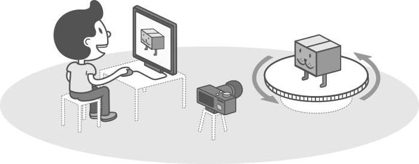
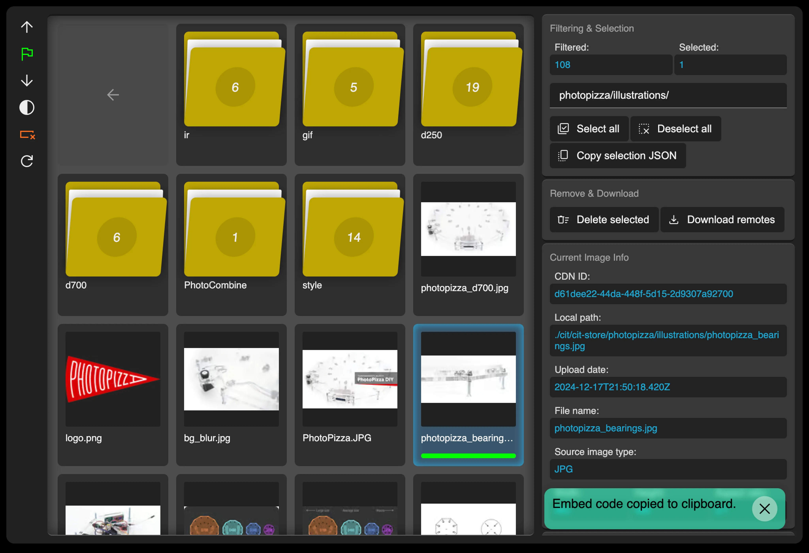

# 📷 PhotoPizza DIY

**PhotoPizza** is an open-source project for creating a turntable that allows you to take pictures of objects from all directions (3D-photo-360 spin-photo). The control unit platform is based on Espruino.

## 📚 Documentation

Our documentation is organized into several sections for easier navigation:

1. [📢 About PhotoPizza](docs/01-about.md) - Project overview and message from the author
2. [🛠️ Hardware Requirements](docs/02-hardware.md) - List of components needed for the control unit
3. [🔄 Turntable Models](docs/03-turntable-models.md) - Different turntable sizes and their components
4. [📱 Control Methods](docs/04-control-methods.md) - IR Remote, Android App, and Wi-Fi control
5. [📸 Operation Guide](docs/05-operation-guide.md) - How to use PhotoPizza for shooting and calibration
6. [🌟 Join the Community](docs/06-community.md) - How to contribute and contact information
7. [🏺 3D Scanning Examples](docs/07-3d-scanning-examples.md) - Real-world examples of 3D scanning projects

## ✨ Features

- 🔄 360° product photography
- 📱 Multiple control options (IR remote, Android app, Wi-Fi)
- 🛠️ DIY-friendly design
- 📊 Customizable shooting parameters
- 🎥 Support for both photo and video shooting
- 📐 Various turntable sizes (D250, D340, D480, D700, D850)
- 🔍 3D scanning with laser scanners
- 📷 3D scanning using photogrammetry methods

## 🚀 Quick Start

1. Choose your turntable size based on your needs
2. Gather all the required components
3. Follow the assembly instructions
4. Install the firmware
5. Connect to your camera
6. Start shooting amazing 360° photos!

## 📥 Downloads

- [📱 Android App](https://github.com/PhotoPizza/remote/blob/master/PhotoPizza.apk)
- [💾 Firmware](Firmware_for_D340_D480_D700/)
- [📐 Laser Cutting Drawings](Drawings_for_laser_cutting/)

## 📚 Related Articles

- [📝 PhotoPizza: From the idea to the Open Source DIY Project](https://rnd-pro.com/pulse/PhotoPizza/)
- [📝 Interactive Media Spots](https://rnd-pro.com/pulse/interactive-media-spots/)
- [📝 ComplexScan AUTOBOX v1](https://rnd-pro.com/pulse/ComplexScan_AUTOBOX_v1/)
- [📝 ComplexScan](https://rnd-pro.com/pulse/ComplexScan/)
- [📝 Web Images: Problems and Solutions](https://rnd-pro.com/pulse/web-images-problem/)

## 📱 Social Media

Follow us on social media for updates, tips, and community showcases:

- [📸 Instagram](https://www.instagram.com/diy.photopizza/)
- [🎬 YouTube](https://www.youtube.com/@PhotoPizza)

## 📞 Contact

For inquiries, please contact: photopizza@rnd-pro.com
